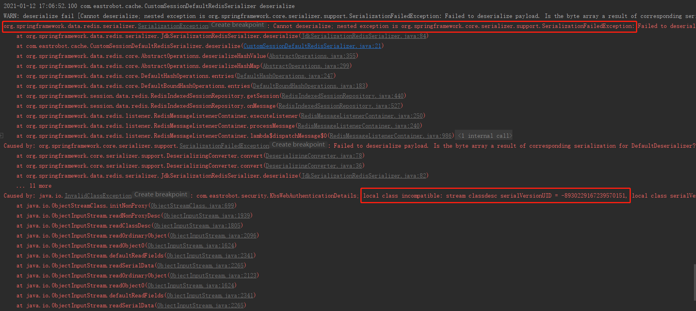

# Java 序列化问题

## 报错了

KbsWebAuthenticationDetails 这个类，反序列化失败。

错误信息中有 serialVersionUID，那就是使用了 JDK 序列化。

## 定位问题原因

反序列化失败了，去看了对应的类，它的父类实现了序列化接口，但当前类没有加 serialVersionUID，这大概就是问题根源了。

划重点：**实现了序列化接口，一定要加 serialVersionUID，即便是父类实现的，子分类也要加。**

## 继续分析

既然没有加 serialVersionUID，那 jdk 会自动生成 serialVersionUID 吧，既然自动生成，那同一个类，自动生成的也应该是一样的吧？

带着这个疑问，后边继续展开~

# 未完待续...

